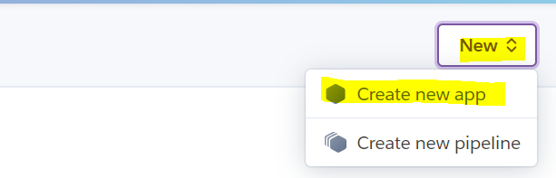
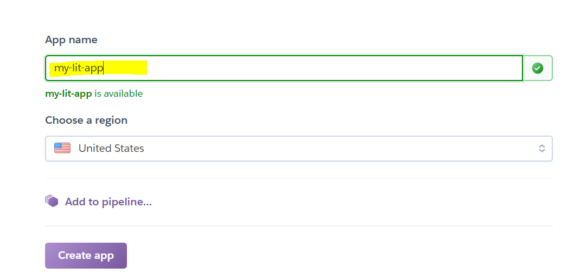
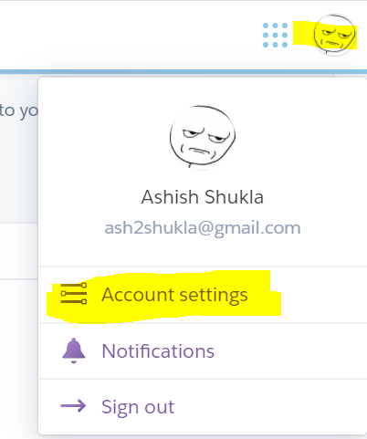
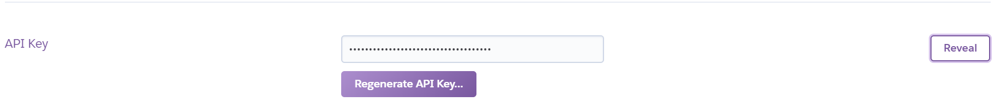
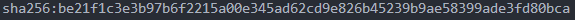

# Prerequisites 📃
1. Docker 🐳
2. cURL or something that can make a patch HTTP request 
3. Heroku Account
4. Free time. 😁

# Steps 🔨
### 1. Build and play with your docker image locally 
```bash
docker-compose up --build
```

### 2. Create a heroku app

1. Login to heroku
2. Click on this



3. Enter your app name



**We will call the app name <APP_NAME> from this point**

### 3. Tag your image in this format
```bash
docker tag streamlit-docker registry.heroku.com/<APP_NAME>/web
```

*replace "streamlit-docker" to your new image name if you have changed image name in docker-compose.yml*


### 4. Get Heroku Oauth token
1. Login to heroku
2. Go to account settings



3. Scroll down click on Reveal and Get your Oauth token



**We will call it <API_KEY> from this point**

### 5. Get your Image Id 
```bash
docker inspect --format="{{.Id}}" registry.heroku.com/<APP_NAME>/web
```

*Psst. Its not IMAGE_NAME !*

It looks something like this



### 5. Login with your API_KEY to heroku container registry

```bash
docker login --username=_ --password=<API_KEY> registry.heroku.com
```

*Yes the username is underscore !*

### 6. Push the image to heroku container registry

```bash
docker push registry.heroku.com/<APP_NAME>/web
```

### 7. Trigger a deployment with cURL or requests or whatever you want.

```bash
curl --netrc -X PATCH https://api.heroku.com/apps/<APP_NAME>/formation \
  -d '{
  "updates": [
    {
      "type": "web",
      "docker_image": "<IMAGE_ID>"
    }
  ]
}' \
  -H "Content-Type: application/json" \
  -H "Accept: application/vnd.heroku+json; version=3.docker-releases"\
  -H "Authorization: Bearer <API_KEY>"
```

### 8. Go to https://<APP_NAME>.herokuapp.com and we are done with deployment. 🎉🎉